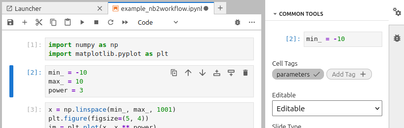
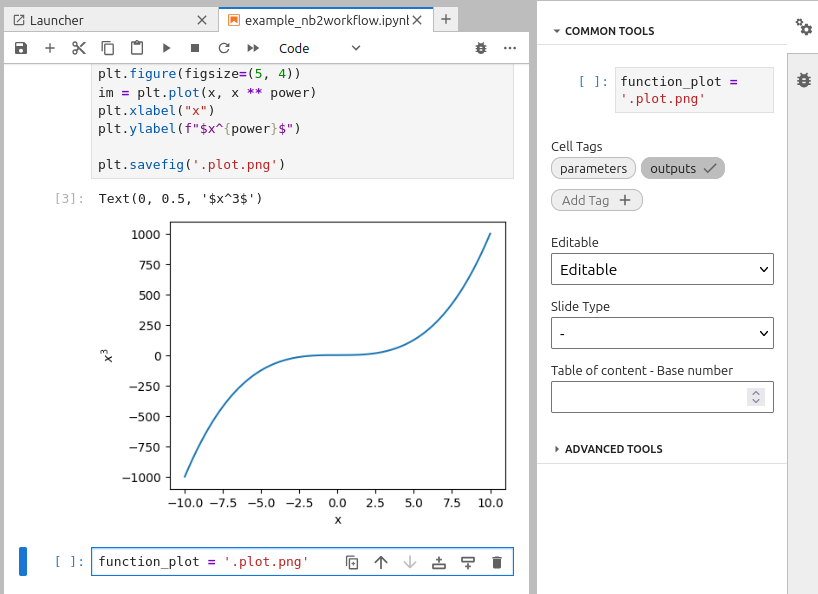
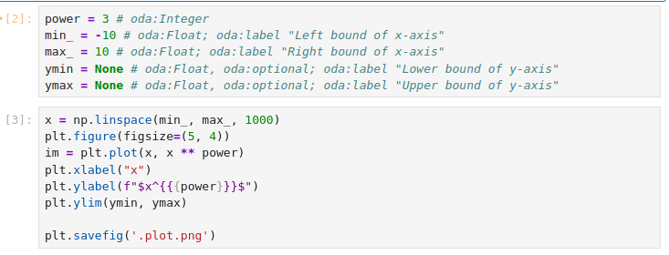
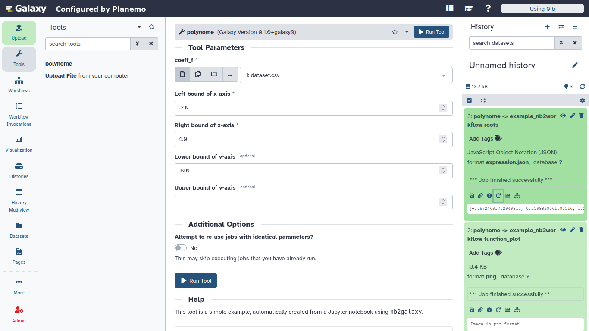

---

layout: tutorial_hands_on
title: "nb2workflow: Generating Galaxy Tools From Jupyter Notebooks"
key_points:
  - The nb2galaxy module of the nb2workflow library is an automated Galaxy tool generator for scientists and developers who routinely write Jupyter Notebooks.
  - nb2workflow is a Python package that can be easily installed via pip.
  - Once a Jupyter Notebook is functional, only a clear separation and definition of the inputs and outputs - along with appropriate annotations and tags - is needed for conversion.
  - The conversion module accepts additional files (e.g., help text, citations, environment specifications) to ensure the generated tool passes planemo lint checks.

objectives:
 - Learn why you might want to use the nb2galaxy.
 - Install the package and explore the provided example notebooks.
 - Modify the examples and regenerate the tools to check the effects.
 - Create new Galaxy tools from your own Jupyter Notebooks.

questions:
 - How can new-to-Galaxy developers convert functioning Jupyter Notebooks into Galaxy tools?
 - How are the inputs and outputs defined?
 - How are the tool dependencies provided?

time_estimation: 1H
subtopic: tooldev

requirements:
  - type: "internal"
    topic_name: introduction
    tutorials:
      - galaxy-intro-short
      - galaxy-intro-101-everyone
  - type: "internal"
    topic_name: dev
    tutorials:
      - tool-integration


contributions:
  authorship:
    - dsavchenko
    - Andrei-EPFL
  funding:
    - eurosciencegateway
    - oscars
    - acme
  editing:
    - Andrei-EPFL

---

With the advance of python and Jupyter Notebooks, many astronomers have started using them for their data analysis pipelines. In response, members of the astronomy and data science communities have developed `nb2galaxy` -- a module of the `nb2workflow` library -- that allows for a quick and easy conversion of Jupyter Notebooks into Galaxy tools. While originally motivated by astronomical use cases, the tool is broadly applicable. This tutorial is therefore aimed at developers and researchers across disciplines who are interested in Galaxy.


> <agenda-title></agenda-title>
>
> 1. TOC
> {:toc}
>
{: .agenda}

# Convert an example Jupyter notebook into a Galaxy tool

This tutorial starts with the setup of the required enviornment and a very basic Jupyter Notebook. Afterwards, each section introduces one or more concepts related to the conversion. The tutorial ends with a more complex example of inputs and outputs.
It is important to mention that the end result of this tutorial is a folder with a `.xml` file that describes the tool and other required files for the tool to function. In order for the tool to be on the UseGalaxy platform, one needs to publish the resulting folder on [toolshed](https://toolshed.g2.bx.psu.edu/) and UseGalaxy.


## Environment Setup

This tutorial uses the JupyterLab interface to edit notebooks, but any Jupyter-compatible editor (such as VS Code) will work just as well. 
The example notebook relies only on the `numpy` and `matplotlib` libraries. Two additional packages are required: `nb2workflow`  that provides the `nb2galaxy` conversion module and `planemo`  which is used to test and preview the generated Galaxy tool locally.
To create a virtual environment with all required packages:

```bash
mkdir nb2galaxy-example
cd nb2galaxy-example
python -m venv .venv
source .venv/bin/activate
pip install jupyterlab numpy matplotlib nb2workflow[galaxy] planemo
```

The initial notebook, that is used to plot a function $y=x^p$ in a given range, can be downloaded from:

```bash
wget https://raw.githubusercontent.com/esg-epfl-apc/nb2galaxy-example-repo/refs/tags/step-0/example_nb2workflow.ipynb
```

Open Jupyter lab to preview the notebook

```bash
jupyter lab
```

## Tagging Inputs and Outputs

Since `nb2galaxy` recognizes cell tags following the **Papermill** convention, one needs to create dedicated cells for the **input** and **output** of the notebook and then tag them accordingly. In the current example, the second cell is tagged as "parameters" and contains the  **input** values:



In order to obtain the **output**, one must save the figure to a file and provide its path in a new cell tagged as "outputs":




## Defining Dependencies

The automatic conversion of the notebook to a Galaxy tool requires an explicit definition of the dependencies. As long as Galaxy uses `conda` to install tool dependencies, the preferred way is to create an `environment.yml` file, even though `nb2galaxy` supports both `environment.yml` and `requirements.txt`. Here's an example `environment.yml`:

```yaml
name: nb2galaxy-example
channels:
  - conda-forge
dependencies:
  - numpy
  - matplotlib
```

When both `environment.yml` and `requirements.txt` are present, `nb2galaxy` attempts to reconcile them using Conda. First, each package from `requirements.txt` is searched by `conda`. If the package with the same name exists in the configured conda channels (only `conda-forge` by default), it is included in the final list of packages for reconciliation. Otherwise, the package is ignored, and a comment is added to the generated tool represented as an XML file.

In the end, all dependencies are resolved together to obtain fixed versions of the required packages that are written in the tool's XML file.

## Notebook to Galaxy tool conversion

At this stage, one can create a very simple Galaxy tool using `nb2galaxy` CLI:

```bash
nb2galaxy --environment_yml environment.yml example_nb2workflow.ipynb ./tooldir
```

This creates the `./tooldir` folder that contains a tool description `.xml` file and a python script file:

```
tooldir/
├── example_nb2workflow.py
└── example.xml

1 directory, 2 files
```

The minimal tool created from the notebook is ready. One can preview it locally with `planemo`:

```bash
planemo serve ./tooldir
```

## Improving the tool

In order to publish a tool on the UseGalaxy platform, the tool needs to pass the `planemo` linting tests. Currently, the example tool does not pass the tests: 

```bash
$ planemo lint ./tooldir/
Linting tool /home/dsavchenko/Projects/ESG/nb2galaxy-example-repo/tooldir/example.xml
.. CHECK (TestsNoValid): 1 test(s) found.
.. INFO (OutputsNumber): 1 outputs found.
.. INFO (InputsNum): Found 3 input parameters.
.. WARNING (HelpMissing): No help section found, consider adding a help section to your tool.
.. CHECK (ToolIDValid): Tool defines an id [example].
.. CHECK (ToolNameValid): Tool defines a name [example].
.. CHECK (ToolProfileValid): Tool specifies profile version [24.0].
.. CHECK (ToolVersionValid): Tool defines a version [0.1.0+galaxy0].
.. INFO (CommandInfo): Tool contains a command.
.. WARNING (CitationsMissing): No citations found, consider adding citations to your tool.
Failed linting
```

The tool requires a "help section" and citations. `nb2galaxy` can extract the "help section" from either `.rst` or `.md` files and citations from a BibTex `.bib` file.

Let us create a markdown file `galaxy_help.md` with the following help text:

```markdown
This tool is a simple example, automatically created from a Jupyter notebook using `nb2galaxy`.
```

and a `CITATION.bib` file:

```bibtex
@software{nb2galaxy-example,
  author = {Variu, Andrei and Savchenko, Denys},
  title = "Example of nb2galaxy",
  url = {https://github.com/esg-epfl-apc/nb2galaxy-example-repo},
  year = {2025}
}
```

Finally, by regenerating the tool

```bash
nb2galaxy --environment_yml environment.yml --citations_bibfile CITATION.bib --help_file galaxy_help.md example_nb2workflow.ipynb tooldir
```

the `planemo lint` tests should pass.

## Annotating input parameters

By default, `nb2galaxy` assumes all input parameters are of type `Integer`. Even though one can change the default configuration, one can explicitly provide parameter types using semantic annotations or python type annotations.

In this tutorial, we focus on semantic annotations because they allow for additional options. Out of the box, the conversion module uses the astronomy-specific ontology, described at <https://odahub.io/ontology/>, although a different ontology can be specified via a CLI option. 

Semantic annotations are added as comments following the parameter assignment. The syntax follows the truncated Turtle format, where the input parameter is implicitly considered the subject and the `a` predicate is optional.
In the current example:

```python
min_ = -10 # http://odahub.io/ontology#Float
max_ = 10 # http://odahub.io/ontology#Float
power = 3 # http://odahub.io/ontology#Integer
```

To improve readability, one can use the `oda:` prefix as a shorthand for <http://odahub.io/ontology#>, similar to how `rdfs:` shortens <http://www.w3.org/2000/01/rdf-schema#>. With this abbreviation, the annotations become:

```python
min_ = -10 # oda:Float
max_ = 10 # oda:Float
power = 3 # oda:Integer
```

Automatically, the variable names are used as labels in the tool interface. However, one can provide custom labels using semantic annotations, allowing for more user-friendly descriptions to be displayed:

```python
min_ = -10 # oda:Float; oda:label "Left bound of x-axis"
max_ = 10 # oda:Float; oda:label "Right bound of x-axis"
power = 3 # oda:Integer
```

Let us modify the notebook to add optional *y*-axis bounds:



The resulting Jupyter notebook is available at <https://github.com/esg-epfl-apc/nb2galaxy-example-repo/blob/step-2/example_nb2workflow.ipynb>.

By recreating the tool 

```bash
nb2galaxy --environment_yml environment.yml --citations_bibfile CITATION.bib --help_file galaxy_help.md example_nb2workflow.ipynb tooldir
```

the `planemo lint` checks should pass and one can locally test the tool using `planemo serve` as before.

## Working with Input Datasets

Jupyter Notebooks often use datasets as inputs. In this section, we explain how to modify the previous notebook to accept a file as input. Specifically, the updated notebook should read polynomial coefficients from a `.csv` file, compute the roots and generate a plot of the corresponding polynomial function.

Firstly, create an input file, `dataset.csv`, which allows to run the notebook. This file also serves as test data for the generated tool.

```csv
-1.2,3.2,6,-2.1
```

Furthermore, replace the `power` input parameter from the notebook with:

```python
coeff_f = 'dataset.csv' # oda:POSIXPath
```

where every parameter annotated with `http://odahub.io/oontology#POSIXPath` or its subclasses is treated as an input dataset.

Read the polynomial coefficients from the input `.csv` file and use the `numpy.polynomial.Polynomial` function:

```python
coeff = np.genfromtxt(coeff_f, delimiter=',')
p = Polynomial(coeff)
```

Update the `plot` method invocation in the next cell

```python
x = np.linspace(min_, max_, 1000)
plt.figure(figsize=(5, 4))
im = plt.plot(x, p(x), label=f"{p}")
plt.xlabel("x")
plt.legend()
plt.ylim(ymin, ymax)

plt.savefig('.plot.png')
```

and add an additional output for the polynomial roots

```python
function_plot = '.plot.png' 
roots = list(p.roots())
```

You can consult the resulting notebook at <https://github.com/esg-epfl-apc/nb2galaxy-example-repo/blob/step-3/example_nb2workflow.ipynb>.

Afterwards, cleanup the tool directory `rm -rf tooldir` and regenerate the tool using the new name `polynome`:

```bash
nb2galaxy --name polynome --environment_yml environment.yml --citations_bibfile CITATION.bib --help_file galaxy_help.md example_nb2workflow.ipynb tooldir
```

Finally, lint the tool with `planemo lint tooldir` and preview it with `planemo serve tooldir`. The tool should accept a dataset as input and generate two outputs: a plot of the polynomial function and a JSON expression with the list of roots of the corresponding polynomial.



## Acknowledgements

This tutorial is part of [EuroScienceGateway project](#funding).
Parts of `nb2workflow` library is developed and tested with support from [OSCARS](#funding), [ACME](#funding),
[AstroORDAS Explore](https://open-research-data-portal.ch/projects/development-of-open-research-data-analysis-services-supplementing-astronomical-open-research-data/) and
[AstroORDAS Establish](https://www.swissuniversities.ch/fileadmin/swissuniversities/Dokumente/Hochschulpolitik/ORD/Calls/Approved_Projects_Track_B.pdf)
projects.